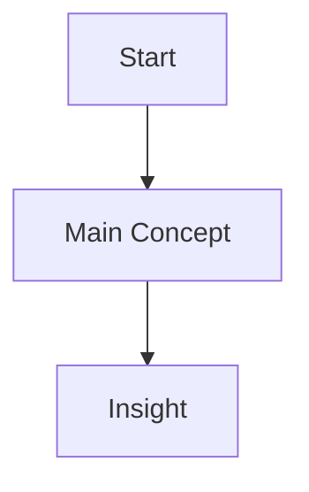

## The Hook

Start with the counterintuitive thing. What's surprising about this topic?

## The Setup

What do readers need to know to understand the main idea? (Keep this SHORT)

## The Main Idea

This is the ONE thing you're explaining. Go deep here.

### Example or Visual

```javascript
// Working code that demonstrates the concept
```

Or a Mermaid diagram:



## The Insight

What's the takeaway? What can readers now do/say/understand that they couldn't before?

## Connection (Optional)

If this connects to a larger theme, mention it briefly (with link). Don't explain it.

---

## Checklist Before Publishing

- [ ] One topic per post (no sidequest explanations)
- [ ] Correct length (3-5 min OR 10+ min, not in between)
- [ ] Has visual or working code
- [ ] Not Google-able (adds unique insight)
- [ ] Clear takeaway/checkpoint
- [ ] Frontmatter valid (run /blog-studio:blog-review)
- [ ] Read aloud test passed (no stumbles)
